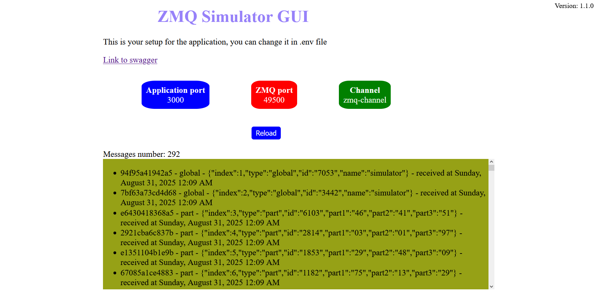
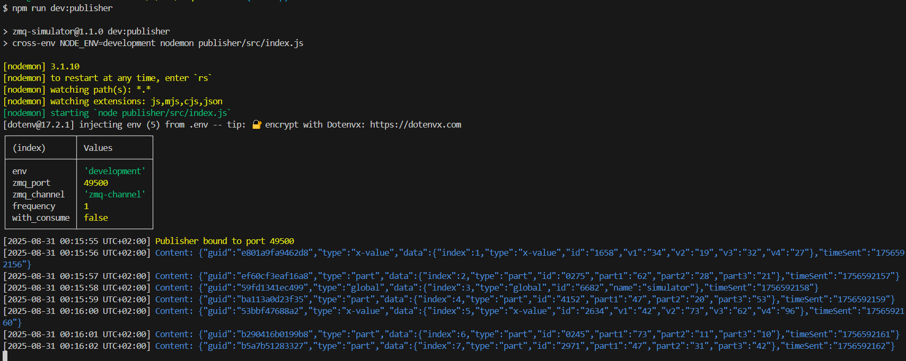

# ZMQ-simulator

**_Version: v1.2.0_**

[](https://github.com/NY-Daystar/ZMQ-Simulator/actions)
[](https://www.gnu.org/licenses/gpl-3.0)
[](https://github.com/NY-Daystar/zmq-simulator/releases)
[](https://sourcegraph.com/github.com/NY-Daystar/zmq-simulator)


<a href="https://codeclimate.com/github/ny-daystar/zmq-simulator/maintainability"></a>  


[](#contributors)


ZeroMQ protocol simulator to send asynchrone data messages.  
You can send it in specific queues for any javascript application.  
Useful in interapplication in the same host  
To know about [ZeroMQ](https://zeromq.org/)

Graphic interface to see data from ZMQ  


Here's the simulator which send messages  


Source code analysed with [DeepSource](https://deepsource.com/)

## Index

- [Prerequisites](#prerequisites)
- [Get started](#get-started)
- [Commands list](#commands-list)
- [VS Code](#vs-code)
- [Credits](#credits)

## Prérequis

- [NodeJs](https://nodejs.org/) >= v24.0.0

## Get started

1. Install node js If you don't have nodejs, you need to install it

```bash
$ sudo apt-get install nodejs
$ npm install -g npm@latest
```

2. Clone repository

```bash
git clone git@github.com:NY-Daystar/ZMQ-Simulator.git
cd ZMQ-Simulator
```

3. Install dependencies

```bash
npm install
```

4. Set configuration

```bash
cp .env.example .env
# open .env and modify the environment variables (if needed)
```

This file look like this, you can change any values

```bash
APP_PORT=3000                   # port to get access to application gui in browswer (http://localhost:3000)
ZMQ_HOST=localhost              # host for zmq to send and receive messages (default: localhost)
ZMQ_PORT=49152                  # port for zmq to send and receive messages (default: 49152)
ZMQ_CHANNEL=zmq-channel         # name of the channel to send and receive message (default: zmq-channel)
FREQUENCY=1                     # seconds between message (default: 1second)
PUBLISHER_ALSO_CONSUME=false    # if you want the publisher program also receive the message itself (default: false)
DATA_FILE_PATH=data.json        # if you want to send specific data use this file otherwise
                                    # you can delete it and it will generate random data
```

5. Launch application in first terminal

```bash
npm run start:publisher
```

in second terminal

```bash
npm run start:consumer
```

6. Or Launch application with docker

```bash
npm run docker
```

You can go now into http://localhost:3000/  
Swagger documentation in http://localhost:3000/v1/docs/

## Commands list

### Launch unit tests

Unit tests executed with jest

```bash
npm run test
```

### Launch unit tests coverage

```bash
npm run test:coverage
```

### Execute linter to check

```bash
npm run lint
```

### Execute prettier

```bash
npm run prettier
```

## Suggestions

- To make a pull request: https://github.com/NY-Daystar/corpos-christie/pulls
- To summon an issue: https://github.com/NY-Daystar/corpos-christie/issues
- For any specific demand by mail: luc4snoga@gmail.com

## Credits

Made by Lucas Noga.  
Licensed under GPLv3.
